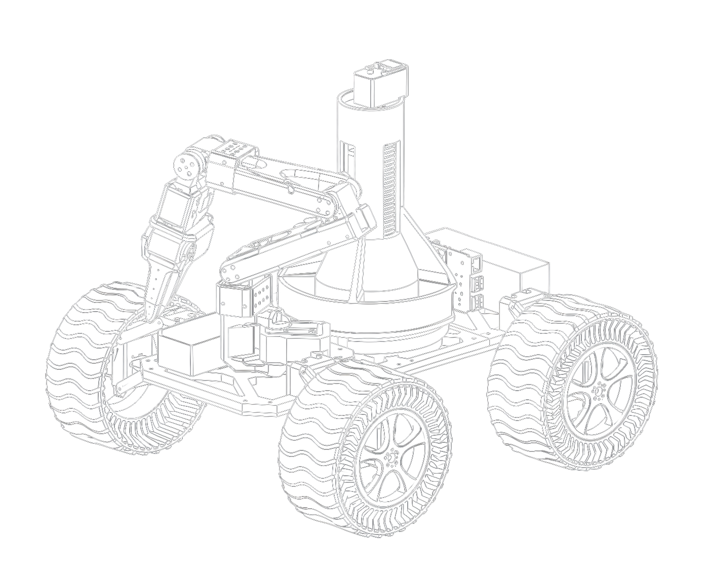

<div align="center">

<picture>
  <source media="(prefers-color-scheme: dark)" srcset="docs/assets/logo-dark.png">
  
</picture>

**Local-first control, telemetry, and operations stack**

</div>

---



Waypoint is a local-first framework for descriptor-defined robotic platforms. A machine's shape (its joints, buses, kinematics, and observation streams) is declared in a platform descriptor TOML, and one set of binaries adapts to it: the safety-critical C++ `core` boots from any descriptor, bringing up the drive subsystem only when the `vehicle_class` calls for it, while a Go `agent` and a React dashboard serve every platform unchanged. A diff-drive rover and a fixed-base servo arm bench run from the same code. A Raspberry Pi 5 on the chassis runs the agent (NATS message bus, WebSocket gateway, WebRTC video, runtime module supervision, audit logging, alerting); `core` owns the motors through an ESP32-bridged STS3215 servo bus. All subsystems communicate over a single NATS subject tree using protobuf messages (contract `v2.3.0`). Capabilities beyond the base platform arrive as runtime modules, built against a Go SDK and declaring typed component APIs. An optional hosted proxy adds remote access, WorkOS-backed authentication, and per-rover role enforcement via native NATS ACLs, without changing how a platform behaves on the local network.

<br clear="left">

## Architecture

```
                              ┌──────────────────────────────────┐
    Browser ───── HTTPS ─────▶│  proxy  ·  Railway (Go)          │
   (same SPA)                 │  NATS hub · WorkOS · Postgres    │
        ▲                     │  module registry · map tiles     │
        │                     └─────────────────┬────────────────┘
        │                                       │  NATS leaf-node uplink
        │                     ┌─────────────────┴────────────────────┐
        └──── HTTP/WS ───────▶│  agent  ·  Pi 5 (Go)                 │
          (LAN, no internet)  │  embedded NATS · WS gateway          │
                              │  cameras (WebRTC) · modules · audit  │
                              └─────────────────┬────────────────────┘
                                                │  NATS over Unix socket
                              ┌─────────────────┴────────────────┐
                              │  core  ·  C++17                  │
                              │  ◀── platform descriptor (TOML)  │
                              │  servo bus · drive · safe-stop   │
                              └─────────────────┬────────────────┘
                                                │  framed UART (ESP32 relay)
                                          STS3215 servo bus
```

**NATS everywhere.** The agent runs an embedded NATS server; the proxy runs a hub in operator mode; the rover joins as a leaf node. Browsers reach the bus through a WebSocket gateway: directly to the agent on the LAN, or through the proxy when remote.

**One schema.** All subjects and message types are defined in `protocol/` as protobuf (contract `v2.3.0`), with generated Go, TypeScript, and C++ bindings. Every component speaks the same wire format.

**One binary, many platforms.** A platform descriptor in `protocol/platform/` (for example `waypoint-rover.toml` or `waypoint-bench.toml`) declares the joints, buses, kinematics, and observation streams of a machine. A shared validator (Go, TypeScript, C++) and golden derived fixtures keep all consumers in agreement. `core` publishes `infra.platform` (a `PlatformInfo`) at startup, and the dashboard adapts at runtime: UI for an absent capability is hidden, not rendered as `N/A`.

**One SPA, two homes.** The dashboard is built once and `go:embed`-ded into both the agent and proxy binaries, serving the same UI whether accessed locally or signed in remotely.

**`N/A` is a first-class state.** Telemetry fields are optional protobuf fields, never sentinel zeros. The UI renders a muted `N/A` with a one-line reason rather than a misleading `0`.

## Capabilities

- **Descriptor-defined platforms:** a diff-drive rover and a fixed-base (arm-only, no wheels) servo arm bench boot from the same `core`, `agent`, and dashboard, each driven by its own descriptor TOML.
- **Drive and teleop:** virtual joystick or gamepad input, speed presets, E-stop and recover, and a full-screen FPV teleop console (present on platforms whose `vehicle_class` has a drive train).
- **Live video:** multiple USB cameras streamed over WebRTC (WHEP), auto-discovered at boot, with TURN relay support for traversal across untrusted networks.
- **Telemetry and mapping:** real-time motor, power, and connectivity readouts; a map view served from self-hosted vector tiles; and an interactive 3D arm overlay.
- **Episodic recording:** label a run from the teleop console and the agent captures its descriptor-declared telemetry, command streams, component state, and capture-stamped H.264 video into a per-episode MCAP file that opens directly in Foxglove Studio. Dataset export (for example to LeRobot) arrives as a module.
- **Fleet and access control:** rover enrollment, WorkOS AuthKit sign-in, and per-rover `monitor`, `control`, and `admin` roles enforced by native NATS ACLs.
- **Runtime modules and component APIs:** add capabilities (connectivity, power monitoring, vision, GPS, arm control) at runtime without rebuilding the image. A module declares a `[component]` class (`arm`, `sensor`, `base`) in its manifest and serves typed protobuf state and command messages (`ArmState`, `ArmCommand`, and so on) on standard sandboxed subjects. Modules are signed and verified before installation.
- **Module SDK:** the Go SDK `sdk/wpmodule` owns the module runtime (connect, creds, health, stats, lifecycle); an author writes a setup function and calls `m.ServeArm(...)`, `m.Servo()`, or `m.TeleopInput()`. Example modules live in `sdk/examples/`.
- **Conformance suites:** a 7-test platform matrix runs against every descriptor-launched platform, and a module conformance suite checks that a module behaves (health, stats, state rate, commands acting through the broker, stop halting motion, E-stop freeze).
- **OTA updates:** A/B partitioned image updates via swupdate, with automatic rollback on repeated boot failures.
- **Audit and alerts:** an append-only audit log and an acknowledge/resolve alert workflow.

## Repository layout

| Path | Language | Role |
|---|---|---|
| `protocol/` | protobuf + Go/TS/C++ | Subject schema, message types, and platform descriptors with shared validator (`protocol/platform/`) |
| `core/` | C++17 | Safety-critical control daemon: descriptor-driven servo bus, drive, safe-stop watchdog. Doubles as its own simulator (`ServoModel`/`SimUart`/`SimClock`) |
| `agent/` | Go | On-rover orchestration daemon: embedded NATS, WS gateway, proxy uplink, cameras, modules, audit, alerts |
| `sdk/` | Go | Module SDK (`wpmodule`) and example modules (`sdk/examples/`) |
| `sim/` | Go | Dev harness and conformance suites (platform matrix and module conformance) |
| `proxy/` | Go | Hosted multi-rover service: NATS hub, WorkOS auth, Postgres, module registry, map tiles |
| `dashboard/` | React + Vite + TS | Single SPA, embedded into both the agent and proxy binaries |
| `image/` | Buildroot | Pi 5 SD-card image (Waypoint OS) and swupdate A/B OTA |
| `firmware/servo-relay/` | C (ESP-IDF) | ESP32 firmware on the Waveshare HAT: transparent UART relay between Pi and servo bus |
| `modverify/` | Go | Shared offline module signature verification |
| `docs/` | Markdown | Setup and operator guides |

## Quickstart (development)

The full stack runs on macOS without hardware. `make dev-rover` boots the real `core` against simulated servos (`ServoModel`/`SimUart`/`SimClock`), so the development loop exercises the actual control daemon, not a stand-in.

```sh
# Zero-hardware loop: real core + simulated servos, selected by descriptor
make dev-rover                 # PLATFORM=rover (default) or PLATFORM=bench
make agent                     # embedded NATS, WS gateway, camera/module/audit plumbing
make dashboard                 # Vite dev server at http://localhost:5173

# Module authors: run a module against the dev stack with zero credentials
make dev-rover                 # in one terminal
make dev-module MODULE=./sdk/examples/arm-sim MODULE_ID=arm-sim

# Proxy (multi-rover remote access)
docker compose up -d postgres
make proxy-init-operator       # one-time operator NKey generation
make proxy
```

Open [`http://localhost:5173/ui-gallery`](http://localhost:5173/ui-gallery) to render every component in the design system against a synthetic data source, useful for UI work without running the full stack.

### Smoke tests

Each subsystem has a Mac-runnable smoke target:

| Target | Exercises |
|---|---|
| `make foundation-smoke` | Sim to agent to dashboard joystick to motor telemetry |
| `make fleet-smoke` | Enroll a rover with the proxy, sign in via WorkOS, drive remotely |
| `make cameras-smoke` | Webcam or synthetic source through WebRTC to CameraView |
| `make core-test` | C++ unit and integration tests (NATS client, STS3215 bus, descriptor, drive kinematics and safety, simulated servos, watchdog) |
| `make image-qemu-boot` / `-ota` / `-rollback` | Boot the production image in QEMU, apply a signed update, verify rollback |
| `make auth-smoke` | NATS ACLs, audit log, alert acknowledge/resolve, user invites |

Run `make test` for the full cross-language suite.

## Modules

Optional capabilities ship as **modules**: independent repositories that require no image rebuild or reflash. A module is a self-contained binary that runs alongside `agent` and `core`, talking to the rest of the platform over NATS inside its own subject sandbox (`waypoint.<rover>.module.<id>.>`). A module declares a `[component]` class (`arm`, `sensor`, `base`) in its manifest and serves typed protobuf state and command messages on the standard component API. The Go SDK `sdk/wpmodule` handles the runtime boilerplate (connect, creds, health, stats, lifecycle); an author writes a setup function and calls `m.ServeArm(...)`, `m.Servo()`, or `m.TeleopInput()`.

1. A module repository builds a squashfs image (`.raw`) in CI and signs it keyless with cosign (Sigstore), using the GitHub Actions OIDC token as the signing identity. There is no key to manage or rotate.
2. An admin registers the module repository with the proxy. The proxy verifies the signature against the repository's release workflow and stores the artifact.
3. Enabling a module on a rover publishes desired state over NATS. The rover's reconciler fetches the `.raw`, attaches it with `portablectl`, and supervises it as a sandboxed systemd portable service.

See [`docs/setup/module-sdk.md`](docs/setup/module-sdk.md) for the authoring guide, [`docs/setup/no-rebuild-modules.md`](docs/setup/no-rebuild-modules.md) for the packaging and install pipeline, and [`sdk/examples/`](sdk/examples) for runnable example modules.

## Setup guides

- [`docs/setup/proxy.md`](docs/setup/proxy.md): Postgres, operator NKey, WorkOS AuthKit, Railway deployment
- [`docs/setup/cameras.md`](docs/setup/cameras.md): GStreamer pipeline, auto-discovery, TURN configuration
- [`docs/setup/core.md`](docs/setup/core.md): CMake, protobuf, gtest, development loop, hardware bring-up
- [`docs/setup/image.md`](docs/setup/image.md): Buildroot build, signing keys, flashing the Pi
- [`docs/setup/firmware.md`](docs/setup/firmware.md): ESP-IDF build, flash procedure, HAT bring-up
- [`docs/setup/module-sdk.md`](docs/setup/module-sdk.md): writing a module in Go with the `wpmodule` SDK and component APIs
- [`docs/setup/no-rebuild-modules.md`](docs/setup/no-rebuild-modules.md): runtime module pipeline end to end
- [`docs/setup/basemap-bucket.md`](docs/setup/basemap-bucket.md): self-hosted vector map tiles
- [`docs/setup/episodes.md`](docs/setup/episodes.md): episodic recording, the MCAP and sidecar format contract, Foxglove QA

## Contributing conventions

See [`CONTRIBUTING.md`](CONTRIBUTING.md) for the contribution workflow and CLA. A few rules are non-negotiable when working in this codebase (full set in [`CLAUDE.md`](CLAUDE.md)):

- UI components are built exclusively from the design system in `dashboard/src/ui/`. Tailwind, MUI, Chakra, and styled-components are not used. Colors come from `dashboard/src/ui/tokens.css`, never inline hex.
- New NATS subjects require an update to `protocol/subjects.toml` and a `VERSION` bump for any breaking change.
- Changes to the C++ `core` touch the safety-critical control path and are made deliberately.

## License

[Apache-2.0](LICENSE), except the hosted proxy under [`proxy/`](proxy/), which
is licensed [AGPL-3.0](proxy/LICENSE): run it, self-host it, modify it, but if
you offer a modified version as a network service you must publish your
changes. Everything a rover or module developer touches (agent, core, SDK,
protocol, dashboard, image) stays Apache-2.0. See [`NOTICE`](NOTICE) for
attributions.

Contributions are accepted under a [Contributor License Agreement](CLA.md); see [`CONTRIBUTING.md`](CONTRIBUTING.md) before opening a pull request.
